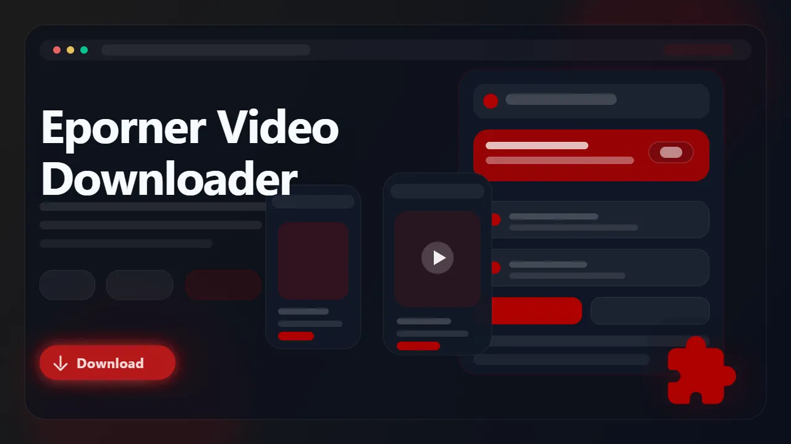

# Eporner Downloader (Browser Extension)

> Download supported Eporner videos as MP4 files from the browser with direct quality selection.

Eporner Downloader is a browser extension for users who want a cleaner way to save supported Eporner videos without juggling HLS tools, generic downloader sites, or manual copy-and-paste workflows. It detects supported video pages in the browser, exposes the available qualities, and exports finished downloads as MP4 for easier playback later.

- Download supported Eporner videos directly from the page
- Choose from the quality options exposed by the source
- Save finished files as standard MP4
- Use in-page controls, popup controls, or right-click actions
- Keep downloads organized in a dedicated folder

## Links

- :rocket: Get it here: [Eporner Downloader](https://serp.ly/eporner-video-downloader)
- :new: Latest release: [GitHub Releases](https://github.com/serpapps/eporner-downloader/releases/latest)
- :question: Help center: [SERP Help](https://help.serp.co/en/)
- :beetle: Report bugs: [GitHub Issues](https://github.com/serpapps/eporner-downloader/issues)
- :bulb: Request features: [Feature Requests](https://github.com/serpapps/eporner-downloader/issues)

## Preview

## Table of Contents

- [Why Eporner Downloader](#why-eporner-downloader)
- [Features](#features)
- [How It Works](#how-it-works)
- [Step-by-Step Tutorial: How to Download Videos from Eporner](#step-by-step-tutorial-how-to-download-videos-from-eporner)
- [Supported Formats](#supported-formats)
- [Who It's For](#who-its-for)
- [Common Use Cases](#common-use-cases)
- [Troubleshooting](#troubleshooting)
- [Trial & Access](#trial--access)
- [Installation Instructions](#installation-instructions)
- [FAQ](#faq)
- [Notes](#notes)
- [License](#license)
- [About Eporner](#about-eporner)

## Why Eporner Downloader

Eporner uses streaming delivery that makes simple right-click saving unreliable, and generic tools often fail to handle the page cleanly. That leaves users with awkward workarounds for a task that should be straightforward.

Eporner Downloader is designed specifically for supported Eporner pages. Instead of pushing you toward generic HLS tooling, it adds a direct browser-based workflow for detecting the media, choosing a quality, and saving an MP4 copy locally.

## Features

- Video downloads from supported Eporner pages
- Quality selection for available stream variants
- In-page controls on supported video pages
- Popup workflow for starting and managing downloads
- Right-click access for a faster saving flow
- MP4 output for easier playback and transfer
- Automatic saving into a dedicated EPORNER folder
- Cross-browser support for Chrome, Edge, Brave, Opera, Firefox, Whale, and Yandex

## How It Works

1. Install the extension from the latest release.
2. Open Eporner and go to the video page you want to save.
3. Start playback so the extension can detect the media.
4. Open the popup or use the on-page controls.
5. Choose the quality option you want.
6. Start the download and wait for the MP4 export to finish.
7. Save the final file locally.

## Step-by-Step Tutorial: How to Download Videos from Eporner

1. Install Eporner Downloader from the latest GitHub release.
2. Open Eporner and navigate to the video page you want.
3. Let the player load fully and press play.
4. Click the extension button or use the on-page download control.
5. Review the quality options shown by the extension.
6. Choose the version you want and begin the download.
7. Wait for the MP4 file to finish exporting.
8. Open the finished file from your Downloads folder.

## Supported Formats

- Input: Supported Eporner videos
- Output: MP4

Saved files use MP4 so they are easier to replay on standard media players, move between devices, or archive locally.

## Who It's For

- Eporner users who want offline copies of supported videos
- Users who want direct browser-based saving instead of external tools
- People who want quality selection before downloading
- Anyone organizing personal downloads into a cleaner local library

## Common Use Cases

- Save a supported Eporner video for offline viewing
- Download the best quality exposed by the page
- Keep a local copy for later playback
- Start downloads directly from the player or extension popup
- Avoid generic downloader sites and manual stream extraction

## Troubleshooting

**The extension is not detecting the video**  
Press play first and wait a few seconds so the media has time to initialize.

**The page control is missing**  
Open the extension popup directly. Some supported pages work better through the popup UI.

**Only one quality option is listed**  
That usually means the page is exposing a single playable stream variant.

**The download failed partway through**  
Check your connection and refresh the page before starting again.

**The page requires account access**  
The extension only works on media you can already open and play in your active browser session.

## Trial & Access

- Includes **3 free downloads** so you can test the workflow first
- Email sign-in uses secure one-time password verification
- No credit card required for the trial
- Unlimited downloads are available with a paid license

Start here: [https://serp.ly/eporner-video-downloader](https://serp.ly/eporner-video-downloader)

## Installation Instructions

1. Open the latest release page:
   [https://github.com/serpapps/eporner-downloader/releases/latest](https://github.com/serpapps/eporner-downloader/releases/latest)
2. Download the extension build for your browser.
3. Install the extension.
4. Open Eporner and navigate to a supported video page.
5. Use the extension controls to start downloading.

## FAQ

**Can I download Eporner videos directly from the page**  
Yes. Supported video pages can be downloaded directly through the extension.

**What file format do downloads use**  
Videos are saved as MP4 files.

**Can I choose the quality**  
Yes. The extension lists the stream variants exposed by the source page.

**Where are videos saved**  
They are saved to your default Downloads location, typically inside an EPORNER subfolder.

**Do I need extra software**  
No. Everything runs through the browser extension.

## Notes

- Only download content you own or have explicit permission to save
- An internet connection is required for downloads
- Source quality depends on the media exposed by Eporner
- Some pages may require account access or site-specific permissions

## License

This repository includes an MIT license in [LICENSE.md](LICENSE.md).

## About Eporner

Eporner is a video site where users often want a straightforward offline copy for later viewing, but the playback layer is not designed around simple file saving. Eporner Downloader simplifies that workflow with in-browser detection, quality selection, and MP4 export.
